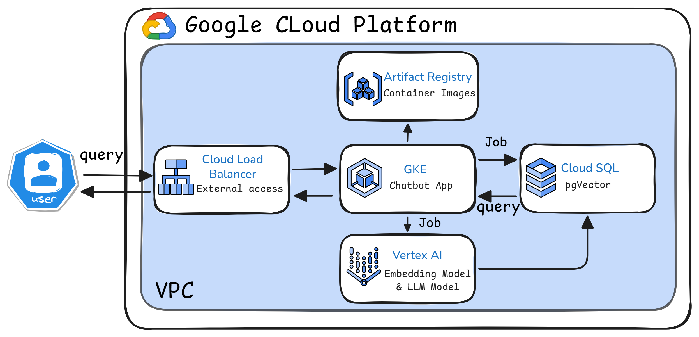

# GenAI App Deployment on GCP using Terraform



This project demonstrates how to build and deploy a basic Generative AI chatbot API using GCP services and Terraform.

## 📌 Key Features

- ⚙️ Infrastructure as Code with **Terraform**
- 🚀 Deploys a FastAPI-based chatbot on **GKE**
- 🔐 Connects securely to **Cloud SQL (PostgreSQL + pgvector)** using **Private Service Connect**
- 🧠 Uses **Vertex AI APIs** for text embedding and LLM responses
- 🐍 Developed with **Python**, **FastAPI**, and **asyncpg**

## Installation and Setup

To get started you will need to install:

- gcloud (with a Google Cloud project configured)
- kubectl (available through gcloud)
- terraform


```sh
gcloud config set project <PROJECT_ID>
```

## Overview 

There are a few steps:

1. Bootstrap Terraform using the terraform-bootstrap folder.
2. Create all infrastructure with the terraform folder
3. Build images for three separate apps using Cloud Build
4. Deploy the apps to GKE and see it all working together!

### Bootstrapping Terraform

First change into the `terraform-bootstrap` directory.

Next create a file called `terraform.tfvars`. This is where we will keep our
local configuration outside of source control. The file should provide values
for the variables in `variables.tf`. For example:

```sh
google_cloud_project        = "gcp-project-name"
google_cloud_default_region = "us-central1"
```
These settings are for the GCS bucket that
will hold all Terraform state files.


```sh
terraform init
terraform plan
```

Next, run:

```sh
terraform apply
```


Finally, run `tf output` to get the bucket name. Save this for the next step,
where we will tell the main Terraform deployment where to save state. The
`tf output` command should show something like:

```sh
storage_bucket = "...-bucket-tfstate"
```

### Create the infrastructure

Now with a storage bucket ready, we can move on to the `terraform` directory
and create the all the infrastructure. First, we need to configure Terraform.

First, create a `backend.conf` file (updating the bucket name to your bucket):

```sh
bucket = "2963768bbef6caf7-bucket-tfstate"
prefix = "terraform/state"
```

Next, run:

```sh
terraform init -backend-config=backend.conf
```

Then, create a `terraform.tfvars` file to configure the deployment. 
```sh
google_cloud_db_project     = "gcp-project-name"
google_cloud_k8s_project    = "gcp-project-name"
google_cloud_default_region = "us-central1"
create_bastion              = false
```


Now that the configuration is done, you can create the infrastructure by running. 
```sh
 tf apply. 
```
This will take a few minutes because Terraform will:

- Set up a VPC with required subnet ranges
- Create a Cloud SQL instance with IAM authentication
- Provision a GKE Autopilot cluster
- Set up an IAM user for app access and DB authentication
- Create a database for the application
- Configure Workload Identity for secure access
- Create an Artifact Registry for Docker images
- And other necessary resources


### Build app images

There are three images we need to build:

1. `init-db`: An app that connects to the database as the superuser and sets
   up permissions and the pgvector extension
2. `load-embeddings`: An app that runs data through VertexAI and loads text
   embeddings into the database using pgvector
3. `chatbot-api`: A simple JSON API that supports natural language queries.

To build the images, change into each directory named above and run the
following command. 

```sh
gcloud builds submit --config cloudbuild.yaml --region <YOUR_CHOSEN_REGION>
```

### Deploy to K8s and see it work!

We have three steps:

1. Deploy the `init-db` job and let it run to completion (fast)
2. Deploy the `load-embeddings` job and let it run to completion (takes a few
   minutes)
3. Deploy the `chatbot-api` app (deployment + service) and interact with it.

Before deploying, we need to update the Kubernetes YAML files to use the correct image paths.

Currently, the image fields in job.yaml and deployment.yaml contain placeholders like __PROJECT__ and __REGION__.

To fix this, just run the provided script — it will automatically replace those placeholders with your actual project ID and region.

```sh
./scripts/configure-k8s.sh <YOUR_PROJECT_HERE> <YOUR_CHOSEN_REGION>

# For example:

./scripts/configure-k8s.sh gcp-project-name us-central1
```

Now let's connect kubectl to your cluster:

```sh
# Run this only if you haven't connected to a GKE cluster with gcloud before
gcloud components install gke-gcloud-auth-plugin

# Now configure kubectl to talk to your cluster
gcloud container clusters get-credentials prod-toy-store-semantic-search \
    --region=<COMPUTE_REGION>
```

Once that's done, we're ready to deploy.

Start by applying the init-db job. This job will:
- Connect to the Cloud SQL database as the postgres user
- Create the application database
- Grant permissions to the IAM user
- Enable the pgvector extension

```sh
kubectl apply -f init-db/k8s/job.yaml
```

```sh
kubectl get jobs
```

Once you see the job is completed, move on to the second job.

```sh
kubectl apply -f load-embeddings/k8s/job.yaml
```

This job takes a few minutes. It needs to parse CSV data, generate text
embeddings using VertexAI, and then load those embeddings into our database
using pgvector.

When that job is done, we're ready to deploy our app:

```sh
kubectl apply -f chatbot-api/k8s/deployment.yaml
```

Next, we'll create a load balancer to make the API accessible from the public
internet.

```sh
kubectl apply -f chatbot-api/k8s/service.yaml
```

The service deployment will take a bit to provision an external IP address.
View the progress with:

```sh
kubectl get services
```

Look for `chatbotapi-service` under the `EXTERNAL-IP` field to find the IP.


### See it work!

Now it's time to test :

```sh
curl -i <EXTERNAL_IP>
```

The root endpoint will print out the Postgres version in the response. If the
app is connected, you'll see the details about your Postgres server.

Next you can run a query against our pgvector data:

```sh
# To send a search do this:
curl <EXTERNAL_IP>/search --get --data-urlencode "q=indoor games"
```

That response will be a bunch of matching toy products.

And finally, we can engage our LLM chatbot like so:

```sh
curl <EXTERNAL_IP>/chatbot --get \
  --data-urlencode "q=what is a good toy for rainy days?"
```

That response will be from VertexAI and should be a single toy product as
picked from all the possible matches.

## Tear it all down

Now that you're done and want to tear all the infrastructure down, first delete
the deployment:

```sh
kubectl delete -f chatbot-api/k8s/deployment.yaml
```

If you created a load balancer also run:

```sh
kubectl delete -f chatbot-api/k8s/service.yaml
```

Then, clean up the infrastructure. 
```sh
cd terraform
terraform destroy
```
